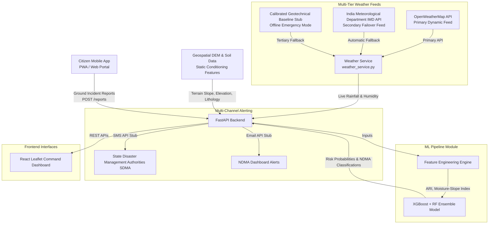

# BhoomiSafe Architecture & System Design

## High-Level Architecture

## Data Flow Diagram

```mermaid
sequenceDiagram
    autonumber
    actor User as Citizen / Admin
    participant App as React Dashboard / Mobile App
    participant API as FastAPI Backend
    participant Weather as Weather Service
    participant ML as ML Service (XGBoost + RF)
    participant Alert as Alert Dispatcher

    rect rgb(20, 30, 40)
        note over App,Weather: Live Environmental Ingestion (District Level)
        App->>Weather: Query District Telemetry (Lat, Lon)
        alt OpenWeatherMap active
            Weather-->>App: Live precipitation & humidity
        else OpenWeatherMap timeout or error
            Weather->>Weather: Failover to India Meteorological Department (IMD) API
            Weather-->>App: Live IMD precipitation metrics
        else Severe Communication Outage
            Weather->>Weather: Failover to Calibrated Baseline Stub
            Weather-->>App: Offline emergency baseline metrics
        end
    end

    rect rgb(30, 40, 30)
        note over User,Alert: Landslide Risk Inference Pipeline
        User->>App: Submits Environmental Parameters / Citizen Report
        App->>API: POST /api/v1/predict (Rainfall, Slope, Soil, Lithology)
        API->>ML: Pass Features to MLService
        alt Binary Ensemble Model Available
            ML->>ML: Feature Engineering (ARI, Moisture-Slope Index) + Ensemble Inference
            ML-->>API: Return Probability, NDMA Tier & Release Version
        else Model Missing / Inference Error
            ML->>ML: Activate Deterministic NDMA Rule-Based Fallback
            ML-->>API: Return Rule-Based NDMA Tier & Log Warning
        end
        alt Risk Level is HIGH or VERY_HIGH
            API->>Alert: Dispatch SMS/Email in Background (Twilio/SendGrid stubs)
            Alert-->>API: Dispatch Confirmation Log
        end
        API-->>App: Return Prediction Response (Risk Level, Color, Prob)
        App-->>User: Display Interactive Risk Popup / Notification Banner
    end
```

## System Component Specs: Built vs. Planned

| Component | Implemented Status | Details & Specifications |
| :--- | :--- | :--- |
| **Multi-Source Weather Feed** | ✅ **Built & Operational** | Primary: OpenWeatherMap API Secondary Failover: Keyless India Meteorological Department (IMD) API Tertiary Fallback: Calibrated geotechnical baseline stub |
| **ML Inference Core** | ✅ **Built & Operational** | Python 3.11/3.12 compatible soft-voting ensemble (XGBoost + Random Forest), versioned as `v2.1.0`. Evaluated via spatial `GroupKFold` & temporal holdout. |
| **NDMA Rule-Based Fallback** | ✅ **Built & Operational** | Deterministic NDMA threshold calculation (`calculate_ndma_fallback`) guaranteeing zero 500 crashes if ML model fails. |
| **FastAPI REST API** | ✅ **Built & Operational** | Modular routers (`/predict`, `/alerts`, `/reports`), background task alert dispatching, CORS, real-time request logging middleware, and `/health` probe. |
| **Security & Rate Limiting** | ✅ **Built & Operational** | `X-API-Key` header authentication on administrative endpoints (`PATCH /reports/{id}/verify`, `POST /alerts`, `PATCH /alerts/{id}/deactivate`). `slowapi` rate limiting (5 req/min per IP) on `POST /reports`. |
| **Alert Dispatch Service** | 🟡 **Stubbed (Config-Gated)** | Multi-channel dispatching to SDMAs and NDMA in `alert_service.py`. When `TWILIO_ACCOUNT_SID` or `SENDGRID_API_KEY` are not set, logs formatted advisory stubs. |
| **Data Persistence** | 🟡 **In-Memory Store** | In-memory Python dictionaries (`_alerts_store`, `_reports_store`) with pre-seeded demo records for UI testing. *(Planned: PostgreSQL + PostGIS)* |
| **Geotechnical Data** | 🟡 **Static Lookups** | Pre-computed CSV files in `data/` (`district_metadata.csv`, `dem_metadata.csv`, `soil_types.csv`). *(Planned: Dynamic raster query)* |
| **Government Dashboard** | ✅ **Built & Operational** | React 18 + Vite dashboard with Leaflet GIS mapping and Recharts historical trends. |
| **Citizen Mobile Portal** | ✅ **Built & Operational** | Lightweight HTML5/CSS/Vanilla JS web app optimized for low-bandwidth 2G/3G connectivity. |
| **Automated Test Suite** | ✅ **Built & Operational** | 19 tests in `tests/` covering `/health`, `/predict` validation, and `/reports` GPS bounds. |

